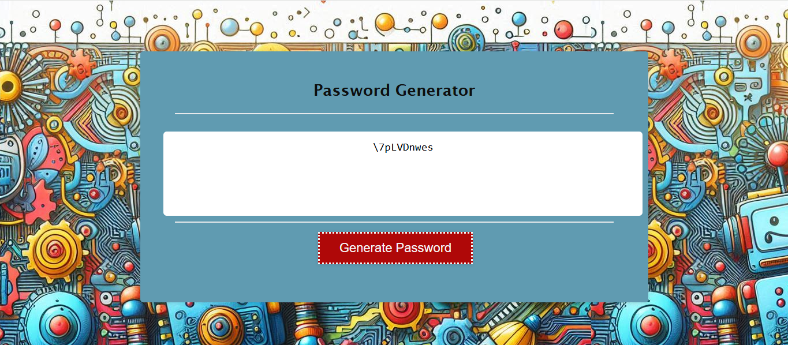

# Password Generator

## Description
This is a simple password generator. The application allows users to generate a random password based on their desired length. 

## Features
 - User-friendly interface with a "Generate Password" button.
 - Alerts prompt the user to specify the desired password length.
 - Random password generation with lowercase, uppercase, numbers, and special characters.

 ## Technologies Used
 -HTML: Structure of the webpage.
 -CSS: Styling and layout.
 -JavaScript: Functionality and password generation.

 ## Link
 Deployed link from github:
 https://hallkr86.github.io/passwordGenerator-kh/